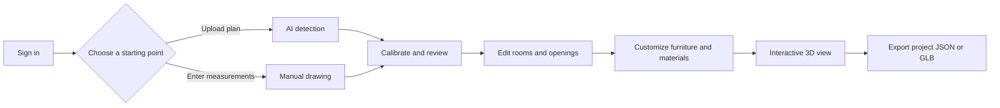

# Plan Weaver

## 1. Overview

Plan Weaver converts floor-plan images or PDFs into an editable 2D plan and an interactive 3D model. Users can also start from measurements and draw a plan manually.

The application has a React frontend and a FastAPI backend. Authentication is required for the workspace and API; there are no built-in default credentials.

## 2. Main Features

- Upload PNG, JPG, WEBP, or PDF floor plans.
- Detect rooms, walls, doors, and windows with an AI pipeline.
- Calibrate dimensions and review or edit detected geometry.
- Draw rooms, walls, doors, and windows from measurements.
- Add furniture, wall finishes, paint, tiles, doors, and windows in 3D.
- Undo and redo project changes, import projects, and export project JSON.
- Export the generated 3D floor plan as GLB.
- Use internal password authentication or optionally configured Google OAuth.

## 3. Application Flow



## 4. AI Model & Dataset

| Item | Details |
| --- | --- |
| Detection model | Ultralytics YOLO; `backend/best_v2.pt` is the default model loaded by the API. |
| Other model artifacts | `backend/best_v4.pt`, `backend/best_v10.pt`, and `backend/dataset_detect.pt` are also present. |
| Detection targets | Rooms, walls, doors, and windows. |
| Training dataset | The source dataset and training metadata are not included or described in the current repository. |
| Input processing | OpenCV preprocessing; PDF input is rasterized with PyMuPDF before inference. |

## 5. Tech Stack

| Category | Technologies |
| --- | --- |
| Frontend | React 18, TypeScript, Vite, Tailwind CSS, shadcn/ui, Vitest |
| Backend | Python 3.11, FastAPI, Uvicorn, Pydantic |
| AI/CV | Ultralytics YOLO, OpenCV, NumPy, PyTorch CPU runtime for Railway builds |
| Geometry | Shapely |
| 3D | Three.js, React Three Fiber, Drei, GLTF/GLB export |
| Deployment | Vercel frontend routing, Railway backend deployment |

## 6. Project Structure

```text
.
├── backend/                 # FastAPI API, auth, models, and backend tests
│   ├── floorplan_api.py     # Detection and geometry pipeline
│   ├── auth.py              # Session and OAuth authentication
│   └── tests/               # Backend authentication tests
├── frontend/                # React/Vite application
│   ├── src/components/      # Workspace UI and editor components
│   ├── src/lib/             # Geometry, project, material, and export logic
│   ├── src/pages/           # Application routes
│   └── public/models/       # Door and window 3D assets
├── audit/                   # Detection pipeline audit outputs
├── tools/                   # Audit and Blender asset scripts
├── railway.json             # Railway build and deployment commands
└── railpack.json            # Railway system package configuration
```

## 7. Setup & Run Locally

### Prerequisites

- Python 3.11
- Node.js and npm
- A machine with enough memory for the YOLO model and image processing

### Environment Variables

Create `backend/.env` from `backend/.env.example`. Create `frontend/.env` from `frontend/.env.example` when a frontend override is needed.

| Variable | Purpose |
| --- | --- |
| `AUTH_SECRET` | Signs and protects server sessions; generate a random value. |
| `AUTH_INTERNAL_USERNAME` | Enables internal username/password login. |
| `AUTH_INTERNAL_PASSWORD_HASH` | Stores the generated password hash, never the password itself. |
| `AUTH_COOKIE_SECURE` | Enables secure cookies for HTTPS deployments; keep `false` for local HTTP. |
| `AUTH_FRONTEND_ORIGIN` | Browser-facing frontend origin used by authentication redirects and policy checks. |
| `AUTH_API_ORIGIN` | Browser-facing origin for the authentication API and OAuth callback. |
| `AUTH_DB_PATH` | SQLite path for sessions and authentication state. |
| `AUTH_SESSION_SECONDS` | Session lifetime in seconds. |
| `GOOGLE_CLIENT_ID` / `GOOGLE_CLIENT_SECRET` | Optional Google OAuth application credentials. |
| `GOOGLE_ALLOWED_EMAILS` / `GOOGLE_ALLOWED_DOMAINS` | Optional exact email and hosted-domain allowlists. |
| `MODEL_PATH` | Optional backend model path; defaults to `best_v2.pt`. |
| `IMG_SIZE` / `MAX_INPUT_SIDE` | Optional inference and input-size limits. |
| `VITE_API_BASE_URL` | Optional frontend API origin; leave empty locally to use Vite proxies. |

### Backend

1. Create and activate a virtual environment, then install dependencies:

   ```sh
   cd backend
   python -m venv .venv
   .venv\Scripts\activate
   python -m pip install -r requirements.txt
   ```

2. Generate local authentication settings. The command prompts for credentials and writes an ignored `.env`:

   ```sh
   python setup_auth.py
   ```

3. Start the API on port 8000:

   ```sh
   python -m uvicorn main:app --env-file .env --host 127.0.0.1 --port 8000 --reload
   ```

	Check `http://127.0.0.1:8000/health` before starting the frontend.

### Frontend

```sh
cd frontend
npm install
npm run dev
```

Open `http://localhost:8080`. Local Vite proxies `/api` and `/auth` to the backend when `VITE_API_BASE_URL` is empty.

### Testing

Run frontend checks from `frontend`:

```sh
npm run lint
npm test
npm run build
```

Run backend authentication tests from `backend`:

```sh
python -m unittest discover -s tests
```

## 8. Known Limitations

- Detection quality depends on the input plan, preprocessing, and selected model weights.
- The training dataset and reproducible training pipeline are not included.
- Authentication requires local setup; no default account or public sign-up flow exists.
- SQLite session storage is intended for a single backend instance and needs shared storage before horizontal scaling.
- Vercel deployment requires `BACKEND_URL` for its `/api` and `/auth` proxy routes; configure deployment origins and cookies carefully.
